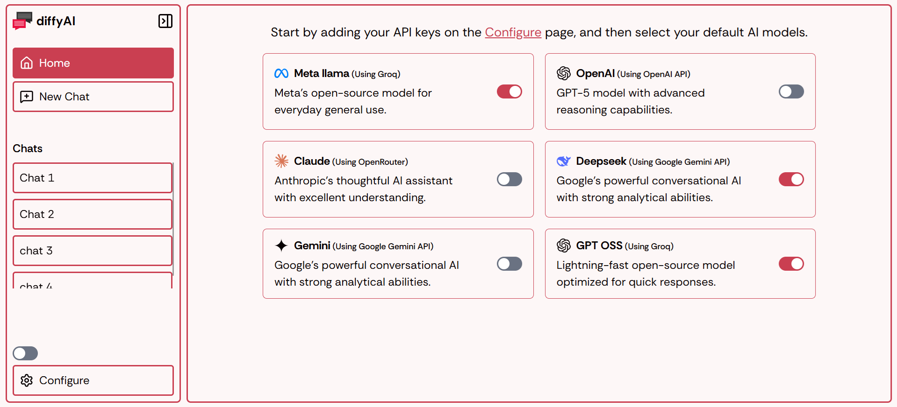
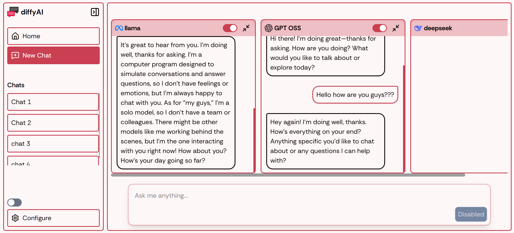
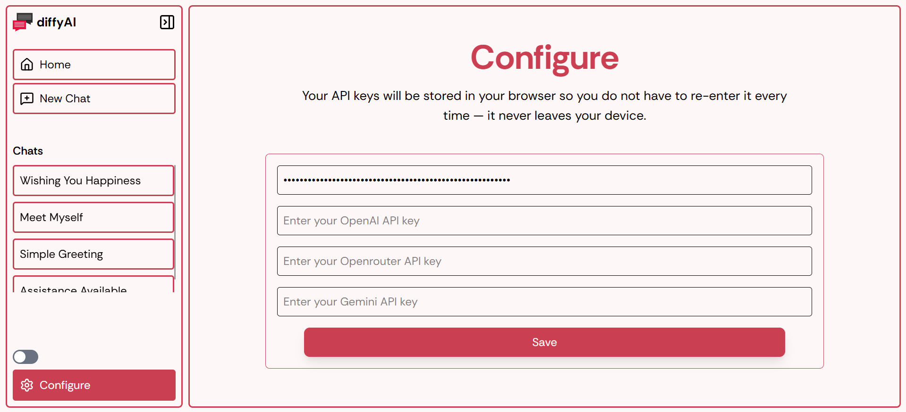

# DiffyAI

**DiffyAI** is a minimal and lightweight AI chat app built with **Next.js** and **TailwindCSS**.

It lets you easily compare responses from multiple AI models, like _OpenAI GPT_, _Claude_, _Gemini_, _LLaMA_, and more - all side by side in one place.

---

## 🚀 Features

-   **🤖 Multi-model support** – Compare AI responses from different models in real-time.
-   **🖥️ Side-by-side view** – See outputs next to each other for easy comparison.
-   **⚡ Minimal and lightweight** – Minimal design and smooth browser performance.
-   **🎛️ Customizable models** – Add or remove AI models as needed.
-   **🌙 Dark mode** – Comfortable on eyes during long usage.
-   **💾 Persistent chat history** – Automatically saves your chats, making it easy to revisit past conversations anytime.
-   **🔑 Custom API key support** – Add and use your own API keys for different AI providers

---

## 📷 Screenshots

---

## 🛠️ Tech Stack

-   **Frontend:** Next.js, React, TailwindCSS
-   **Backend:** Node.js
-   **AI Models:** OpenAI, Claude, Gemini, LLaMA, and more.

---

## 🤝 Contributing

Contributions, issues, and feature requests are welcome! Feel free to open an issue or submit a PR.
